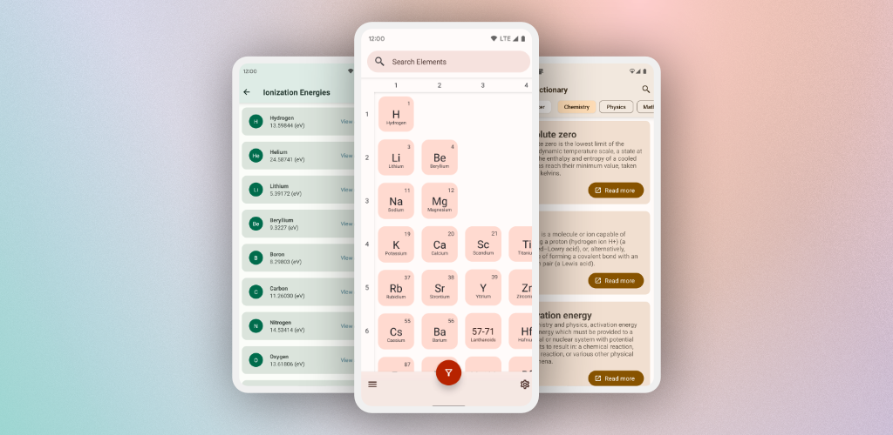

#  Periodic-Table-Data

## Introduction
A repository with data for elements in a Periodic Table from my app 'Atomic - Periodic Table' available on Android.

Follow on socialmedia for updates [TWITTER](https://twitter.com/jlindemanndev)

## Download

Visit the [website](https://www.jlindemann.se/homepage/atomic) for app information

Play Store: [Link](https://play.google.com/store/apps/details?id=com.jlindemann.science)